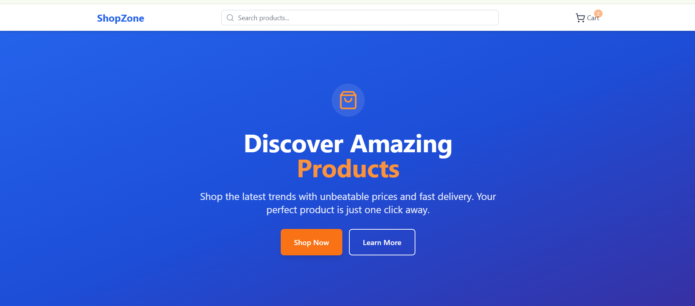

# 🛍️ ShopZone

ShopZone is a modern e-commerce web application where users can discover and shop amazing products with unbeatable prices and fast delivery.  
This project showcases a responsive UI with a clean, minimal design and smooth user experience.

---

## 🚀 Features
- 🔍 **Search bar** to find products easily  
- 🛒 **Cart integration** for quick shopping  
- 🎨 **Beautiful hero section** with call-to-action buttons (Shop Now, Learn More)  
- 📱 **Responsive design** for mobile, tablet, and desktop  
- ⚡ Fast and lightweight front-end  

---

## 🖼️ Preview


---

## 🛠️ Tech Stack
- **Frontend:** React.js, HTML5, CSS3  
- **Styling:** Tailwind CSS (or custom CSS, if used)  
- **Version Control:** Git & GitHub  

---

## 📂 Project Setup

1. Clone the repository:
   ```bash
   git clone https://github.com/sakshijha8/Shop-Zone.git
